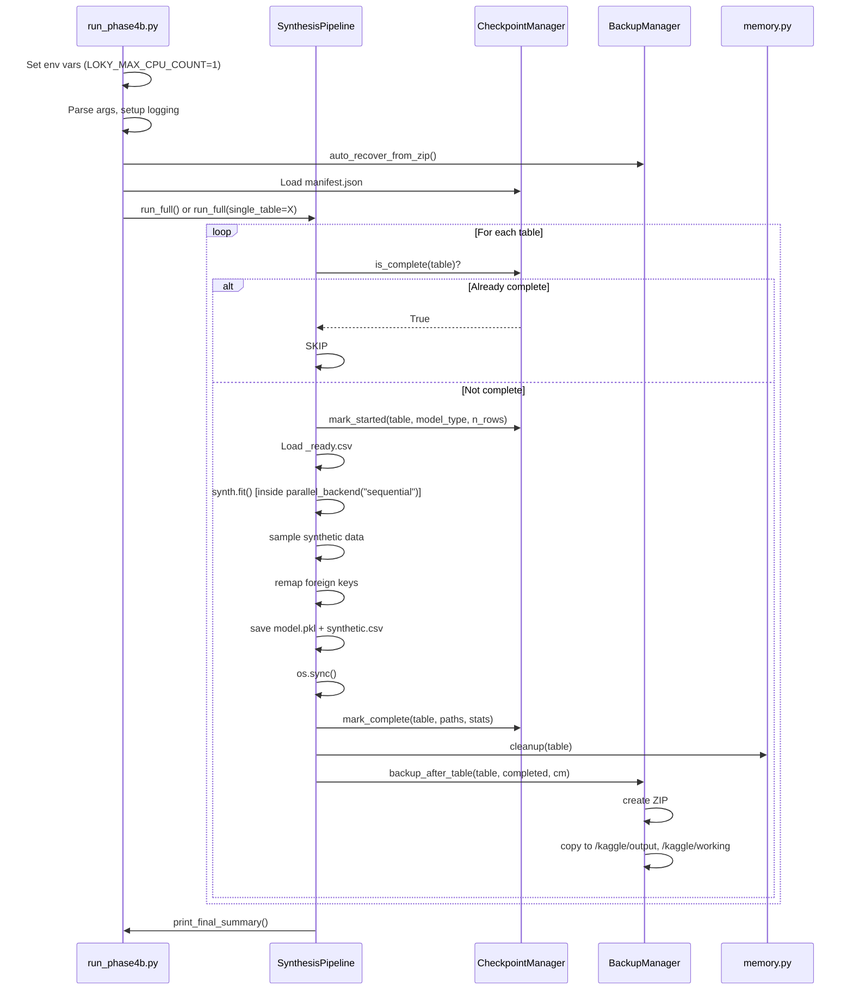

# 05 — Training Pipeline

**Version:** 1.0  
**Last Updated:** 2026-06-28  
**Phase Coverage:** Phase 4B  
**Source Files:** [run_phase4b.py](../run_phase4b.py), [src/synthesis/pipeline.py](../src/synthesis/pipeline.py), [src/synthesis/checkpoint.py](../src/synthesis/checkpoint.py), [src/synthesis/backup.py](../src/synthesis/backup.py), [src/synthesis/memory.py](../src/synthesis/memory.py)

---

## Table of Contents

1. [Training Pipeline Overview](#1-training-pipeline-overview)
2. [The Fault-Tolerance Problem](#2-the-fault-tolerance-problem)
3. [Environment Variable Safety: Preventing SIGKILL](#3-environment-variable-safety-preventing-sigkill)
4. [Startup Sequence](#4-startup-sequence)
5. [GPU Detection](#5-gpu-detection)
6. [CheckpointManager and manifest.json](#6-checkpointmanager-and-manifestjson)
7. [Training One Table: run_single_table()](#7-training-one-table-run_single_table)
8. [Memory Management](#8-memory-management)
9. [BackupManager: Per-Table ZIPs](#9-backupmanager-per-table-zips)
10. [Synthetic Data Sampling](#10-synthetic-data-sampling)
11. [Foreign Key Remapping](#11-foreign-key-remapping)
12. [Statistics and Monitoring Files](#12-statistics-and-monitoring-files)
13. [Single-Table CLI Mode](#13-single-table-cli-mode)
14. [Failure Recovery: Auto-Recovery from ZIP](#14-failure-recovery-auto-recovery-from-zip)
15. [Complete Sequence Diagram](#15-complete-sequence-diagram)
16. [Source File Responsibilities](#16-source-file-responsibilities)

---

## 1. Training Pipeline Overview

The Phase 4B training pipeline trains five generative models and produces five synthetic
CSVs. It is designed to survive crashes without losing completed work.

```
Startup
  ├─ Set env vars (prevent joblib fork bombs)
  ├─ GPU detection
  ├─ Auto-recover from ZIP (if session was wiped)
  ├─ Load manifest.json (see which tables are done)
  └─ Print workflow banner

For each table [patients, encounters, observations, conditions, medications]:
  ├─ Check manifest → SKIP if already complete
  ├─ Load data/ready/{table}_ready.csv
  ├─ mark_started() in manifest
  ├─ Train model (CTGAN or PAR)
  │     └─ parallel_backend("sequential") wrapping synth.fit()
  ├─ Sample synthetic data
  ├─ Remap foreign keys
  ├─ Save model → outputs/models/{table}_model.pkl
  ├─ Save synthetic CSV → outputs/synthetic/synthetic_{table}.csv
  ├─ os.sync() (flush to disk)
  ├─ mark_complete() in manifest (with SHA-256 hashes)
  ├─ gc.collect() × 2 + cuda.empty_cache()
  └─ Create ZIP → SynthFHIR_checkpoint_after_{table}.zip
       └─ Copy to /kaggle/output, /kaggle/working, Google Drive

Final summary
```

**Table training order:** `patients → encounters → observations → conditions → medications`

This order is not arbitrary. `patients` must be trained first because all other tables
reference `patient_id`. Encounters must be trained before conditions and medications
because those tables reference `encounter_id`.

---

## 2. The Fault-Tolerance Problem

### What Happened in Phase 4A

During Phase 4A testing, the Kaggle kernel crashed with:

```
joblib.externals.loky.process_executor.TerminatedWorkerError:
A worker process managed by the executor was unexpectedly terminated.
The process quit with exit code -9 [SIGKILL]
```

The crash occurred inside `DataTransformer.transform()` during the first table's
preprocessing — before even one epoch of training completed. When the kernel died:

- `/kaggle/working` (the working directory) was **completely wiped** by Kaggle
- All output files (models, CSVs, logs) were **permanently lost**
- There was no checkpoint to resume from

### Why the Crash Is Unkillable (Without the Fix)

The Linux operating system includes an **OOM Killer** (Out-Of-Memory Killer). When
available RAM drops below a threshold, the OOM Killer selects a process to terminate
using `SIGKILL` (signal number 9). `SIGKILL` is sent directly from the kernel —
it cannot be caught, blocked, or handled by Python's `try/except`. The Python process
simply ceases to exist, mid-operation.

`DataTransformer.transform()` triggers this because it uses `joblib.Parallel(n_jobs=-1)`,
which by default spawns one worker process per CPU core. On Kaggle's 4-core CPU:

```
Parent process: loads observations DataFrame (303,696 rows × 9 columns ≈ 140 MB)
  ├─ Worker 1: receives COPY of DataFrame (additional 140 MB)
  ├─ Worker 2: receives COPY of DataFrame (additional 140 MB)
  ├─ Worker 3: receives COPY of DataFrame (additional 140 MB)
  └─ Worker 4: receives COPY of DataFrame (additional 140 MB)

Total: 140 MB (original) + 4 × 140 MB (copies) = 700 MB
Kaggle RAM: ~16 GB — but other processes are also running
Available: insufficient → SIGKILL
```

The COPY happens because joblib uses the `loky` process start method. Each child process
is a fresh Python interpreter that receives the arguments through pickle serialisation —
which means the 140 MB DataFrame is serialised, sent through a pipe, and deserialised in
each worker. This happens before any computation begins.

### The Fix (Phase 4B)

Two complementary fixes:

**Fix 1: Force single-threaded DataTransformer**

```python
# At the very top of run_phase4b.py — before ANY imports
import os
os.environ.setdefault("LOKY_MAX_CPU_COUNT", "1")
os.environ.setdefault("OMP_NUM_THREADS",     "1")
os.environ.setdefault("MKL_NUM_THREADS",     "1")
os.environ.setdefault("NUMEXPR_NUM_THREADS", "1")
os.environ.setdefault("OPENBLAS_NUM_THREADS","1")
```

`LOKY_MAX_CPU_COUNT=1` limits joblib's loky backend to 1 CPU → no child processes.
The DataTransformer runs in the parent process using 0 additional copies of the DataFrame.

**Fix 2: Wrap every synth.fit() in sequential backend**

```python
from joblib import parallel_backend

with parallel_backend("sequential"):
    synth.fit(df)
```

This is the belt-and-suspenders second layer. Even if an SDV version update changes how
DataTransformer calls joblib, the `parallel_backend("sequential")` context manager ensures
that any joblib call inside `synth.fit()` runs sequentially in the main process.

**Why the env vars alone are not sufficient:**  
Some versions of numpy, scipy, and sklearn also use joblib or OpenBLAS threads. The full
set of environment variables covers all known thread pool implementations.

**Why the parallel_backend alone is not sufficient:**  
`parallel_backend` only affects joblib calls that respect the context manager. Native
OpenBLAS or MKL thread pools are controlled by environment variables, not by joblib's
context manager.

**Result after the fix:**  
If memory is insufficient, Python raises `MemoryError` (a normal Python exception that
can be caught in `try/except`) instead of the OS sending `SIGKILL`. The pipeline catches
`MemoryError` and falls back to `GaussianCopulaSynthesizer`.

---

## 3. Environment Variable Safety: Preventing SIGKILL

The environment variables **must** be set before any SDV/joblib/sklearn/numpy import.
This is because joblib reads thread pool settings at import time, not at usage time.

The ordering in `run_phase4b.py` is:

```python
from __future__ import annotations   # Must be first statement per Python grammar

import os                             # Standard library — safe before any others
os.environ.setdefault("LOKY_MAX_CPU_COUNT",   "1")
os.environ.setdefault("OMP_NUM_THREADS",       "1")
os.environ.setdefault("MKL_NUM_THREADS",       "1")
os.environ.setdefault("NUMEXPR_NUM_THREADS",   "1")
os.environ.setdefault("OPENBLAS_NUM_THREADS",  "1")

# Only AFTER env vars are set:
import sys
import logging
import pandas as pd     # numpy imports OpenBLAS
from sdv import ...     # SDV imports joblib
```

**Why `setdefault` and not direct assignment?**  
`os.environ.setdefault("KEY", "1")` only sets the variable if it is not already set.
This allows users who know what they are doing to override the settings by setting
environment variables before running the script. Direct assignment (`os.environ["KEY"] = "1"`)
would override user settings — potentially breaking intentional multi-threaded configurations
on workstations with large RAM.

---

## 4. Startup Sequence

When `run_phase4b.py` starts (or `run_phase4b.py --table X`), the following startup
sequence runs:

```
1. Parse CLI arguments (--table, --force, --gpu, --gdrive-dir, --smoke)
2. Set up logging (console + file: outputs/logs/training.log)
3. Detect environment (Kaggle / Colab / local)
4. Auto-recover from ZIP checkpoint (if manifest.json is missing)
5. Load SynthesisConfig from config/settings.yaml
6. GPU detection: torch.cuda.is_available()
7. Create CheckpointManager (loads or creates manifest.json)
8. Create BackupManager (detects backup destinations)
9. Print startup banner:
   ══════════════════════════════════════════════════════════
     SynthFHIR — Phase 4B: Fault-Tolerant Synthesis
     Date          : 2026-06-28 09:15:32
     Platform      : Kaggle
     GPU           : Tesla T4  (16 GB)
     Environment   : Kaggle
     Backup dests  : /kaggle/output  /kaggle/working
     Completed     : patients (from previous run)
   ══════════════════════════════════════════════════════════
10. Create SynthesisPipeline
11. Dispatch to run_full() or _run_single_table()
```

---

## 5. GPU Detection

```python
import torch

use_cuda = torch.cuda.is_available()
if use_cuda:
    device_name = torch.cuda.get_device_name(0)
    vram_mb = torch.cuda.get_device_properties(0).total_memory / 1024**2
    logger.info("GPU: %s  (%.0f MB VRAM)", device_name, vram_mb)
else:
    device_name = "CPU"
    logger.info("No GPU detected — training on CPU (will be slow)")
```

The `cuda` flag is passed to each synthesiser:

```python
CTGANSynthesizer(metadata, cuda=use_cuda, epochs=300, batch_size=500)
PARSynthesizer(metadata, cuda=use_cuda, epochs=300)
```

SDV handles the device placement internally — no manual `tensor.to("cuda")` calls are needed.

---

## 6. CheckpointManager and manifest.json

**Source file:** `src/synthesis/checkpoint.py`

`CheckpointManager` maintains `outputs/logs/manifest.json` — the authoritative record
of what has been completed.

### Manifest JSON Structure

```json
{
  "version": "1.0",
  "created_at": "2026-06-28T09:15:32",
  "updated_at": "2026-06-28T11:42:18",
  "system_info": {
    "platform": "Linux-5.4.0-kaggle",
    "cpu_count": 4,
    "total_ram_gb": 15.9,
    "gpu_name": "Tesla T4",
    "cuda_version": "12.1",
    "gpu_total_mb": 16160,
    "torch_version": "2.3.0",
    "sdv_version": "1.37.2",
    "python_version": "3.10.14"
  },
  "config": {
    "epochs": 300,
    "batch_size": 500,
    "n_synthetic_patients": 1000,
    "seed": 42
  },
  "tables": {
    "patients": {
      "status": "completed",
      "model_type": "ctgan",
      "n_rows": 998,
      "model_path": "outputs/models/patients_model.pkl",
      "csv_path": "outputs/synthetic/synthetic_patients.csv",
      "model_hash_sha256": "a1b2c3d4...",
      "csv_hash_sha256": "e5f6a7b8...",
      "model_size_mb": 12.3,
      "csv_size_mb": 0.14,
      "training_duration_s": 245.3,
      "synthetic_rows": 1000
    },
    "encounters": {
      "status": "pending",
      ...
    }
  },
  "zips": [
    {
      "path": "SynthFHIR_checkpoint_after_patients.zip",
      "created_at": "2026-06-28T09:19:47",
      "tables_included": ["patients"],
      "size_mb": 14.1
    }
  ]
}
```

### Atomic Writes

Every `manifest.json` update uses an **atomic write** to prevent corruption:

```python
def save(self) -> None:
    tmp = self._path.with_suffix(".json.tmp")
    tmp.write_text(json.dumps(self._data, indent=2, default=str))
    try:
        tmp.replace(self._path)   # POSIX rename — atomic
    except Exception:
        shutil.copy2(tmp, self._path)  # Windows fallback
        tmp.unlink(missing_ok=True)
```

**Why atomic writes?**  
If the process is killed (SIGKILL or power outage) while writing a JSON file, the result
is a partially-written, corrupted file. Reading a corrupted `manifest.json` would cause
the pipeline to crash or, worse, incorrectly mark incomplete tables as complete.

The atomic pattern:
1. Write to a temporary file (`.json.tmp`)
2. Rename the temp file to the target (`.json`)

On Linux/macOS, `rename()` is a POSIX-guaranteed atomic operation — it either completes
fully or not at all. The JSON file can never be in a half-written state.

### SHA-256 Hash Verification

When marking a table complete, `mark_complete()` computes SHA-256 hashes of both the
model `.pkl` and the synthetic `.csv`:

```python
import hashlib

def _sha256(path: Path) -> str:
    h = hashlib.sha256()
    with open(path, "rb") as f:
        for chunk in iter(lambda: f.read(65536), b""):
            h.update(chunk)
    return h.hexdigest()
```

On restart, `is_complete()` re-computes these hashes and compares them to the stored
values. If a file was corrupted (incomplete write, bit rot) or partially deleted, the hash
mismatch triggers re-training of that table.

### is_complete() Logic

```python
def is_complete(self, table_name: str) -> bool:
    entry = self._data["tables"].get(table_name, {})
    if entry.get("status") != "completed":
        return False
    
    model_path = Path(entry.get("model_path", ""))
    csv_path   = Path(entry.get("csv_path", ""))
    
    if not model_path.exists() or not csv_path.exists():
        self._data["tables"][table_name]["status"] = "file_missing"
        self.save()
        return False
    
    return True
```

**Why check both manifest status AND file existence?**  
The manifest might say "completed" but the file might be gone. This happens when:
- Kaggle wipes `/kaggle/working` after a session expires (the directory is deleted, but
  the manifest is recovered from the ZIP)
- A user manually deletes a file thinking it can be recovered from the ZIP

`is_complete()` returns `False` in this case, triggering re-training for that table only.

---

## 7. Training One Table: run_single_table()

**Source:** `SynthesisPipeline.run_single_table()` in `src/synthesis/pipeline.py`

This method encapsulates the complete lifecycle for one table:

```python
def run_single_table(
    self,
    table_name:         str,
    pk_col:             str,
    use_cuda:           bool,
    device_name:        str,
    tracker:            ProgressTracker | None,
    checkpoint_mgr:     CheckpointManager | None,
    table_index:        int = 1,
    n_tables:           int = 1,
    n_real_patients:    int | None = None,
    synthetic_patients: pd.DataFrame | None = None,
) -> dict | None:
```

### Steps Inside run_single_table()

**Step 1: Skip check**
```python
if checkpoint_mgr and checkpoint_mgr.is_complete(table_name):
    logger.info("[SKIP] %s already complete", table_name)
    return None
```

**Step 2: Load data**
```python
df = pd.read_csv(self.ready_dir / f"{table_name}_ready.csv", low_memory=False)
```

**Step 3: Mark started**
```python
checkpoint_mgr.mark_started(table_name, model_type, n_rows=len(df))
```
The manifest is immediately written to disk — if the kernel dies mid-training, we know
which table was in progress.

**Step 4: Train model (inside parallel_backend("sequential"))**
```python
from joblib import parallel_backend

with parallel_backend("sequential"):
    if model_type == "par":
        synth, used_type = PARTrainer(cfg).train(df, meta, ...), "par"
    else:
        synth, used_type = self._train_table(table_name, model_type, df, meta, ...)
```

The `parallel_backend("sequential")` context ensures that `synth.fit()` and all nested
joblib calls use the sequential backend regardless of what SDV's internals request.

**Step 5: Sample synthetic data**
```python
synthetic_df = sampler.sample(synth, model_type, ...)
```

**Step 6: Assign synthetic primary keys**
```python
synthetic_df[pk_col] = [str(uuid.uuid4()) for _ in range(len(synthetic_df))]
```

**Step 7: Remap foreign keys**
```python
if "patient_id" in synthetic_df.columns:
    synthetic_df["patient_id"] = remap_patient_ids(synthetic_df, synthetic_patients)
```

**Step 8: Save outputs**
```python
synth.save(str(model_path))
synthetic_df.to_csv(csv_path, index=False)
```

**Step 9: Flush to disk**
```python
try:
    os.sync()    # POSIX — guarantees writes are committed to storage
except AttributeError:
    pass         # Windows: os.sync() does not exist; filesystem flush happens on close
```

**Why `os.sync()`?**  
Python's `file.write()` copies data to the OS kernel buffer. The kernel may not write
this buffer to the actual storage device for several seconds (buffered I/O for performance).
If the kernel receives SIGKILL during this window, the file on disk may be incomplete.

`os.sync()` forces the kernel to flush all pending writes to storage. It is a blocking
call — it does not return until the write is confirmed. On Windows, `os.sync()` does not
exist as a function (AttributeError is silently ignored); the `close()` call in pandas
`to_csv()` achieves the same effect through the Windows `FlushFileBuffers()` mechanism.

**Step 10: Mark complete in manifest**
```python
checkpoint_mgr.mark_complete(
    table_name, model_path, csv_path,
    stats={"training_duration_s": elapsed, "synthetic_rows": len(synthetic_df)}
)
```

**Step 11: Memory cleanup**
```python
del synth      # Release the model object
gc.collect()   # First pass: free zero-reference-count objects
gc.collect()   # Second pass: free objects with __del__ that first pass finalised
if use_cuda:
    torch.cuda.empty_cache()
    torch.cuda.synchronize()
```

**Why two `gc.collect()` calls?**  
Python's garbage collector works in passes. The first call frees all objects with zero
reference counts. Some of these freed objects have `__del__` finaliser methods that create
additional inter-object references, making other objects collectable. The second pass
frees these newly eligible objects. Most deep learning libraries (PyTorch, numpy) use
`__del__` for GPU/memory cleanup.

---

## 8. Memory Management

**Source file:** `src/synthesis/memory.py`

### memory.py Responsibilities

1. **Set environment variables** that force single-threaded operation
2. **Monitor RAM and GPU** usage with `psutil` and `torch.cuda`
3. **Provide cleanup()** — a standardised memory sweep
4. **Write memory_usage.csv** — per-operation memory snapshots

### cleanup() Implementation

```python
def cleanup(label: str = "") -> dict:
    before_ram = _ram_used_mb()
    before_gpu = _gpu_alloc_mb()
    
    gc.collect()
    gc.collect()
    
    if torch and torch.cuda.is_available():
        torch.cuda.empty_cache()
        torch.cuda.synchronize()
    
    after_ram = _ram_used_mb()
    after_gpu = _gpu_alloc_mb()
    
    return {
        "label": label,
        "ram_before_mb":  before_ram,
        "ram_after_mb":   after_ram,
        "ram_freed_mb":   before_ram - after_ram,
        "gpu_freed_mb":   before_gpu - after_gpu,
    }
```

`psutil.Process().memory_info().rss` gives the Resident Set Size (RSS) — the amount
of physical RAM currently occupied by the process. `torch.cuda.memory_allocated()` gives
the amount of GPU memory currently allocated by PyTorch tensors.

If `psutil` is not installed, memory monitoring silently returns 0.0 values — training
is not interrupted.

---

## 9. BackupManager: Per-Table ZIPs

**Source file:** `src/synthesis/backup.py`

After each table completes, `BackupManager.backup_after_table()` is called:

```python
backup_mgr.backup_after_table(
    table_name="patients",
    completed_tables=["patients"],
    checkpoint_mgr=checkpoint_mgr,
)
```

### What Goes Into a ZIP

```
SynthFHIR_checkpoint_after_patients.zip
├─ outputs/
│   ├─ models/
│   │   └─ patients_model.pkl
│   ├─ synthetic/
│   │   └─ synthetic_patients.csv
│   └─ logs/
│       ├─ manifest.json     ← includes hash + status for patients
│       ├─ training.log
│       ├─ system_info.json
│       └─ memory_usage.csv
└─ data/
    └─ ready/
        └─ metadata.json     ← needed to reload models in a fresh session
```

**What is NOT in the ZIP:**

```
data/ready/*.csv   ← Real patient data — privacy; not backed up
outputs/reports/   ← Re-creatable from data; too large
outputs/figures/   ← Re-creatable; too large
```

### Multi-Destination Distribution

After creating the ZIP, it is copied to all detected destinations:

```python
def _detect_destinations(self) -> list[Path]:
    dests = []
    for p in ("/kaggle/output", "/kaggle/working"):
        if Path(p).exists():
            dests.append(Path(p))
    if Path("/content/drive").exists():
        dests.append(Path("/content/drive/MyDrive/SynthFHIR"))
    return dests
```

| Destination | Why |
|---|---|
| `/kaggle/output` | Kaggle preserves this as a "dataset output" that persists between sessions — primary recovery source |
| `/kaggle/working` | Primary working dir; ZIP appears in the Kaggle Output panel for download |
| `/content/drive/MyDrive/SynthFHIR` | Google Drive (Colab only); survives Colab session disconnection |
| Project root | Always available locally |

### Manifest Update Inside ZIP

Before finalising the ZIP, the manifest is updated to record the ZIP itself:

```python
checkpoint_mgr.record_zip(zip_path, completed_tables)
self._create_zip(zip_path)  # Re-create to include updated manifest
```

This means the `manifest.json` inside the ZIP accurately reflects which tables were
complete at the time of that ZIP — making recovery precise.

---

## 10. Synthetic Data Sampling

**Source file:** `src/synthesis/sampler.py`

After training, synthetic data is sampled from the fitted model:

```python
# For CTGAN
synthetic_df = synth.sample(num_rows=n_synthetic_patients)

# For PAR
synthetic_df = synth.sample(
    num_sequences=n_synthetic_patients,
    sequence_length=None,  # Model determines length from training distribution
)
```

**Why sample 1,000 patients?**  
The training set has 998 patients. Sampling 1,000 gives a synthetic dataset of comparable
size. Too few synthetic samples reduces the utility of the synthetic dataset for downstream
applications. Too many would risk amplifying model errors.

The `n_synthetic_patients` parameter (from `config/settings.yaml`) controls all table
sizes consistently. Child tables are generated by sampling the number of events that the
model predicts for 1,000 patients — this number will be close to but not identical to
the real table size (the model does not know the exact real-world counts).

---

## 11. Foreign Key Remapping

After sampling, synthetic records have:
- New synthetic primary keys (new random UUIDs)
- Foreign key columns that reference the **original real** patient IDs or encounter IDs

These FK values are meaningless and would break relational integrity.

The sampler performs FK remapping:

**Step 1: Build a mapping from original patient IDs to synthetic patient IDs**

The `synthetic_patients.csv` was generated with new UUIDs. The FK remapping needs to
assign each child record to one of these new patient UUIDs.

```python
# synthetic_patients has synthetic UUIDs as patient_id
# synthetic_encounters has original training patient_ids (wrong)
# We need to replace the original IDs with synthetic IDs

# How many encounters per synthetic patient (from the model)?
# The PAR model assigns each sequence to one patient implicitly
# We remap by position: sequence 0 → synthetic_patient_0, etc.
```

**Step 2: Remap encounter_id in observations, conditions, medications**

Similarly, `encounter_id` columns in child tables are remapped to point to synthetic
encounter IDs.

This FK remapping ensures that the five synthetic tables form a valid relational database
— every synthetic observation references a real synthetic encounter, which references a
real synthetic patient.

---

## 12. Statistics and Monitoring Files

The pipeline writes several supporting files to `outputs/logs/`:

### system_info.json

Written at startup. Records the full system configuration:

```json
{
  "platform": "Linux-5.4.0",
  "hostname": "kaggle-kernel",
  "cpu_count": 4,
  "total_ram_gb": 15.9,
  "gpu_name": "Tesla T4",
  "cuda_version": "12.1",
  "gpu_total_mb": 16160,
  "torch_version": "2.3.0",
  "sdv_version": "1.37.2",
  "python_version": "3.10.14"
}
```

### memory_usage.csv

Written throughout training by `_MemCSVWriter`. Records RAM and GPU state at key points:

```csv
timestamp,label,ram_mb,avail_ram_gb,gpu_alloc_mb,gpu_total_mb,gpu_pct
2026-06-28T09:15:32,before_patients_train,3421.2,12.5,0.0,16160,0.0
2026-06-28T09:19:47,after_patients_train,5834.1,10.0,892.4,16160,5.5
2026-06-28T09:19:58,after_patients_cleanup,3512.8,12.3,0.0,16160,0.0
```

### manifest.json

See section 6. The comprehensive record of all completed work with hashes and timings.

### training.log

The full structured log file. Every INFO and above log message is written here, with
timestamps, allowing post-hoc reconstruction of exactly what happened and when.

---

## 13. Single-Table CLI Mode

Phase 4B supports training one table at a time:

```bash
python run_phase4b.py --table observations
python run_phase4b.py --table patients --force
```

### Startup Banner (Single-Table Mode)

```
==========================================
  TABLE TRAINING MODE
  Table  : observations
  Model  : CTGAN
  Epochs : 300
  Rows   : 303,696
  GPU    : Tesla T4
==========================================
```

### Finish Banner

```
==========================================
  Training Complete
  Time          : 2 hr 15 min 23 sec
  Table         : observations
  Model         : outputs/models/observations_model.pkl
  Synthetic Rows: 304,210
  Model Size    : 45.3 MB
  ZIP           : outputs/table_observations.zip  (47.0 MB)
==========================================
```

### Kaggle DOWNLOAD READY Banner

```
==========================================
  DOWNLOAD READY
  /kaggle/working/table_observations.zip

  Kaggle Output panel → click the file to download.
==========================================
```

### Resume Prompt

If a checkpoint exists for the requested table and `--force` is not specified:

```
Checkpoint found for "observations". The model and CSV already exist.
Retrain? (y/N): 
```

If the user types `N` (or presses Enter), the existing files are preserved and a fresh
ZIP is created from the existing outputs. If `y`, training starts from scratch for that
table.

The `EOFError` exception (which occurs in non-interactive environments like Kaggle
where stdin is not a terminal) is caught and treated as "N" — the safe default.

### Single-Table ZIP

For single-table mode, the ZIP is named differently:

```
outputs/table_{table_name}.zip
```

vs. the rolling checkpoint ZIP:

```
SynthFHIR_checkpoint_after_{table_name}.zip  (at project root)
```

The naming distinction makes it easy to identify which files are table-specific downloads
and which are full checkpoint archives.

---

## 14. Failure Recovery: Auto-Recovery from ZIP

If a Kaggle session expires (common for long-running training), the working directory
`/kaggle/working` is wiped. The only surviving outputs are those copied to `/kaggle/output`.

On the next run, before doing anything else:

```python
from src.synthesis.backup import auto_recover_from_zip

recovered = auto_recover_from_zip(project_root, outputs_dir)
if recovered:
    logger.info("Recovered from ZIP. Resuming from checkpoint.")
```

`auto_recover_from_zip()` logic:

1. Check if `outputs/logs/manifest.json` already exists → if yes, not a fresh start, do nothing
2. Search `/kaggle/output`, `/kaggle/input`, and the project root for files matching
   `SynthFHIR_checkpoint_after_*.zip`
3. Pick the ZIP that covers the most completed tables (ranked by table position in
   `TABLE_SEQUENCE`)
4. Extract the ZIP to the project root
5. Return True

After recovery, `manifest.json` inside the ZIP is loaded. Tables marked "completed" in
the manifest are skipped. Training resumes from the next pending table.

### Recovery Workflow (Step by Step for Kaggle)

```
Session 1: Training starts
  patients → complete → ZIP → copied to /kaggle/output ✓
  encounters → complete → ZIP ✓
  observations → SIGKILL before epoch 50
  /kaggle/working wiped ✗

Session 2: New kernel
  auto_recover_from_zip finds SynthFHIR_checkpoint_after_encounters.zip in /kaggle/output
  Extracts: patients_model.pkl, encounters_model.pkl, both synthetic CSVs, manifest.json
  manifest.json: patients=completed, encounters=completed, observations=pending
  Training resumes at observations
  observations → complete → ZIP ✓
  conditions → complete → ZIP ✓
  medications → complete → ZIP ✓
```

---

## 15. Complete Sequence Diagram



---

## 16. Source File Responsibilities

| File | Responsibility |
|---|---|
| `run_phase4b.py` | CLI entry point: argument parsing, startup banner, dispatch to full/single-table mode |
| `src/synthesis/pipeline.py` | Training orchestrator: `run_full()`, `run_single_table()`, `_train_table()`, FK remapping |
| `src/synthesis/ctgan_trainer.py` | Wraps CTGANSynthesizer/TVAESynthesizer/GaussianCopulaSynthesizer |
| `src/synthesis/par_trainer.py` | Wraps PARSynthesizer; handles SDV 1.37.2 sequence_key metadata injection |
| `src/synthesis/sampler.py` | Post-training sampling and synthetic primary key generation |
| `src/synthesis/checkpoint.py` | manifest.json read/write, atomic saves, SHA-256 verification |
| `src/synthesis/backup.py` | ZIP creation, multi-destination copy, auto-recovery, single-table ZIP, Kaggle banner |
| `src/synthesis/memory.py` | Environment variable setup, RAM/GPU monitoring, cleanup(), memory_usage.csv writing |
| `src/synthesis/config.py` | `SynthesisConfig` dataclass: loads settings.yaml synthesis section |
| `src/synthesis/progress.py` | `ProgressTracker`: per-table progress bars and final summary table |
